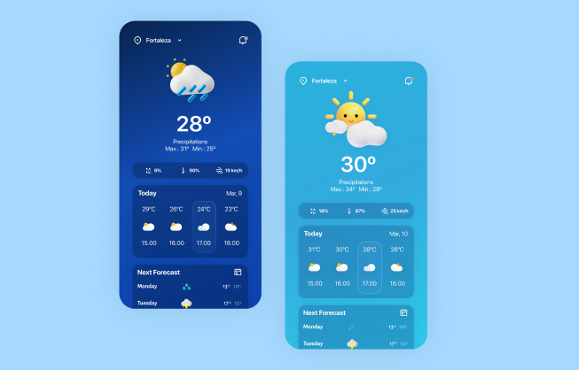

<p align="center">

</p>

# Weather App

## Project Overview
The Weather App is a responsive web application built using **React.js** and styled with **Tailwind CSS**. The app fetches real-time weather data from a weather API, providing users with accurate and up-to-date weather information for their desired locations.

---

## Features
- **Search Functionality**: Users can search for current weather conditions in any city.
- **Real-Time Updates**: Fetches and displays live weather data.
- **Responsive Design**: Optimized for various devices using Tailwind CSS.
- **Dynamic Backgrounds**: The background changes based on weather conditions.
- **Error Handling**: Displays user-friendly messages for invalid cities or API errors.

---

## Technologies Used

### Front-End
- **React.js**: Component-based architecture for building dynamic user interfaces.
- **Tailwind CSS**: For responsive and modern styling.

### API Integration
- **Weather API**: Fetches weather data using `fetch` or `axios`.

---

## Getting Started

### Prerequisites
Make sure you have the following installed on your system:
- Node.js (v14 or higher)
- npm or yarn

### Installation Steps
1. Clone the repository:
   ```bash
   git clone https://github.com/leo-lifecode/weather-app.git
   ```

2. Navigate to the project directory:
   ```bash
   cd weather-app
   ```

3. Install dependencies:
   ```bash
   npm install
   ```
   or
   ```bash
   yarn install
   ```

4. Obtain an API key:
   - Sign up for a free API key from a weather API provider (e.g., OpenWeatherMap).

5. Start the development server:
   ```bash
   npm start
   ```
   or
   ```bash
   yarn start
   ```

## Usage
1. Type the name of a city in the search bar.
2. Press Enter or click the search button.
3. View the current temperature, weather conditions, and more.

---

## Future Enhancements
- Add hourly and weekly weather forecasts.
- Include geolocation to fetch the user's current location automatically.
- Enhance the UI with animations for weather transitions.
- Implement a dark mode toggle.

---

## License
This project is licensed under the [MIT License](LICENSE).

---

## Acknowledgments
- [React.js Documentation](https://reactjs.org/)
- [Tailwind CSS Documentation](https://tailwindcss.com/)
- [Weather API Documentation](https://openweathermap.org/api)

